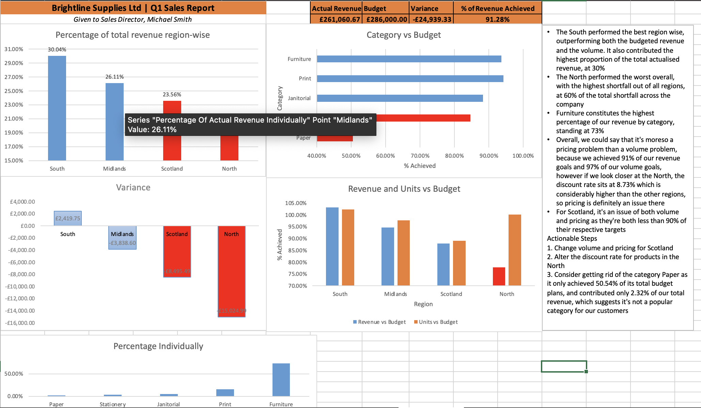

#Brightline Supplies Ltd — Q1 Sales Performance Analysis
## The problem
Q1 revenue came in under budget. The Sales Director could not explain why.
I was given a raw ERP export and asked which region underperformed, which
category drives revenue and whether the shortfall was volume or pricing.
## The data
159 rows of order-level sales data, plus a budget file and an approved
discount list. Excel only.
## Cleaning
- Removed 5 duplicate orders
- Standardised 16 spellings of 4 regions using TRIM and PROPER
- Converted units, prices and dates from text to usable types
- Excluded 5 orders with no quantity(units), documented in the workbook
- Joined an approved discount list with Xlookup to get net revenue
## Findings
- Q1 net revenue GBP 261060.67 against a GBP 286,000 plan, a GBP 24,939.33 miss
- Scotland and the North caused 84% of the shortfall
- Scotland: pricing and units. 87.86% of its budget for revenue and 89.1% of its unit plan
- The North: pricing. a miniscule 77.9% of its budget revenue, yet 100% of its unit plan, with 8.73% discount
rate against under 1.5% elsewhere
- Furniture is 73.5% of revenue and 53% of the shortfall
- Overall, we could say that it's moreso a pricing problem than a volume problem, because we achieved 91% of our revenue goals and 97% of our volume goals, however if we look closer at the North, the discount rate sits at 8.73% which is considerably higher than the other regions, so pricing is definitely an issue there
- For Scotland, it's an issue of both volume and pricing as they're both less than 90% of their respective targets
## Recommendation
1. Change volume and pricing for Scotland
2. Alter the discount rate for products in the North
3. Consider getting rid of the category Paper as it only achieved 50.54% of its total budget plans, and contributed only 2.32% of our total revenue, which suggests it's not a popular category for our customers
## Dashboard

## Tools
Excel: Xlookup, SUMIFS, PivotTables, conditional formatting, charting

